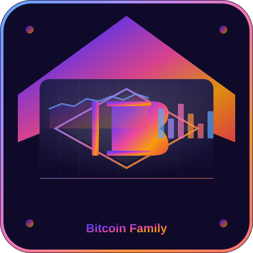

<p align="center">
  
</p>

# Bitcoin Family Dashboard on StartOS

> Everything not listed in this document should behave the same as upstream Bitcoin Family Dashboard.
> If a feature, setting, or behavior is not mentioned here, the upstream
> documentation is accurate and fully applicable — see the Documentation section of
> `instructions.md` for links.

## Overview

Bitcoin Family Dashboard is a fully client-side Bitcoin dashboard for tracking family BTC holdings, live prices, 24-hour changes, and historical performance. Originally built as a simple HTML dashboard, this package wraps it for StartOS with rich configuration via Actions & Config.


### Key features

- **Live price** from your choice of source: **Coinbase Exchange**, **Binance**, **Bitstamp**, or a **Custom API**
- **Family members** — add, remove, and update members with BTC holdings and average cost basis
- **Custom avatars** — hover a member's avatar to upload a picture; auto center-crop to 150×150, resize, and JPEG-encode entirely in the browser
- **Three rotating charts** — 30-day, 1-year, and 10-year price history, rotating every 60 seconds with a log scale on the long view
- **Dark mode** — a pill toggle in the top-right (persisted in the browser), with a near-black chart theme
- **Pexels backgrounds** — optional rotating landscape photos (free API key required)

## Table of Contents

- [Overview](#overview)
- [Image and Container Runtime](#image-and-container-runtime)
- [Volume and Data Layout](#volume-and-data-layout)
- [File Models](#file-models)
- [Dependencies](#dependencies)
- [Network Access and Interfaces](#network-access-and-interfaces)
- [Installation and First-Run Flow](#installation-and-first-run-flow)
- [Actions](#actions)
- [Tasks](#tasks)
- [Health Checks](#health-checks)
- [Backups and Restore](#backups-and-restore)
- [Limitations and Differences](#limitations-and-differences)

## Image and Container Runtime

The service runs `nginx:alpine` serving the static dashboard. The image entrypoint seeds a default `config.json` on first boot (Satoshi, 0.125 BTC @ $40k cost basis), then nginx serves the site and proxies outbound price/background API calls so browsers never hit CORS or expose API keys.

## Volume and Data Layout

| Volume | Mount | Purpose |
|--------|-------|---------|
| `main` | `/data` | Persistent `config.json` — dashboard configuration |

## File Models

- **`config.json`** — the single dashboard configuration file, stored on the `main` volume at `/data/config.json`. Seeded on first install with a default Satoshi member and Coinbase as the price source. Edited exclusively through the StartOS **Actions** menu; hand-edits survive restarts but may be overwritten by actions.

## Dependencies

None.

## Network Access and Interfaces

- **Web UI** — the dashboard, exposed as a `ui` interface on port 80.
- Outbound HTTP from the container: price APIs (Coinbase Exchange, Binance, Bitstamp, custom), Pexels API for backgrounds, and chart data providers.

## Installation and First-Run Flow

Install via **Sideload Service**. On first start the container seeds `config.json` with a default Satoshi member, then serves the dashboard. Configure members, price source, background rotation, and dark mode from the Actions menu.

## Actions

| Action | Purpose |
|--------|---------|
| **Add Family Member** | Add a member with name, BTC holdings, and average cost basis |
| **Remove Family Member** | Remove an existing member |
| **Update Family Member** | Change BTC holdings or cost basis |
| **Configure Price Source** | Pick Coinbase Exchange (default), Binance, Bitstamp, or a Custom API |
| **Configure Background** | Enable/disable rotating Pexels landscape backgrounds and set the API key |

## Tasks

None.

## Health Checks

- **Web Interface** — verifies nginx is listening on port 80.

## Backups and Restore

The `main` volume is snapshotted; `config.json` (members, price source, Pexels settings) is included in backups and restored on restore.

## Limitations and Differences

- Price source 24-hour change: Coinbase Exchange and Binance do not provide a 24h-change figure in their simple ticker responses, so the dashboard derives it from the spot price 24 hours ago. Bitstamp provides `percent_change_24` directly.
- Custom avatars are stored in browser `localStorage` (per-device), not in `config.json`, so they are not included in StartOS backups.

---

## Quick Reference for AI Consumers

```yaml
package_id: 'bitcoin-family-dashboard'
image:
  - nginx:alpine (custom entrypoint + templates)
architectures:
  - x86_64
  - aarch64
subcontainers:
  - web (nginx, port 80)
volumes:
  - main (config.json)
file_models:
  - config.json
startos_managed_env_vars:
  - PRICE_UPSTREAM
  - PRICE_HOST
dependencies: []
interfaces:
  - ui (port 80)
actions:
  - add-member
  - remove-member
  - update-member
  - configure-price-source
  - configure-background
tasks: []
health_checks:
  - web (port 80)
```
