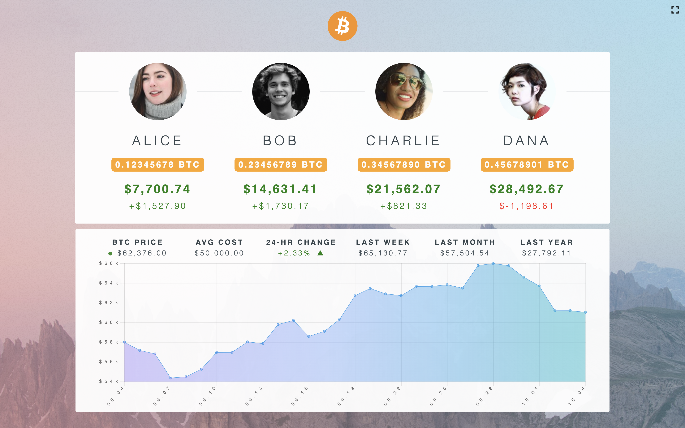

# Bitcoin Family Dashboard

**Bitcoin Family Dashboard** is an open-source, fully client-side Bitcoin dashboard for tracking family BTC holdings, live prices, 24-hour changes, and historical performance. Inspired by [btcframe/bitcoinfamily](https://github.com/btcframe/bitcoinfamily), it has been substantially rewritten for self-hosting — dark mode, watch-only wallets, rotating charts, and per-member configuration.

## Features

- **Real-time Bitcoin price** from common sources (CoinGecko, Binance, Coinbase, Bitstamp) or a custom API
- **Per-family-member BTC holdings** with USD value and P&L
- **Manually enter bitcoin quantity** or point a member at a **watch-only wallet** (output descriptor)
- **Three rotating charts** — 30-day, 1-year, and 10-year price history
- **Historical price comparisons** — 1 week, 1 month, 1 year
- **Auto-generated profile avatars** (pravatar), updatable on the dashboard
- **Landscape background rotation** via Pexels (optional)
- **Dark mode** and **fullscreen-ready**

> **Please note:** This dashboard is intended for internal and personal use on localhost. Do not publish your private information on the internet.

## Install as a StartOS service

This repository is the dashboard application. A StartOS package wrapper lives in the
[bitcoin-family-dashboard-startos](https://github.com/wahidsaleemi/bitcoin-family-dashboard-startos)
repository — install it from there (or from the Start9 Community Registry) to run the dashboard on StartOS with Actions & Config, Bitcoin Core watch-only balances, and automatic backups.

## Run it locally

Download the whole package and open `index.html` in a browser. Edit the family members and their Bitcoin holdings directly in the file or via the in-page configuration.

## Contributing

Fork the repository, make changes, and submit pull requests. Contributions that improve the dashboard and enhance its features for family use are welcome.

## License

This project is licensed under the [Blue Oak Model License 1.0.0](LICENSE).
